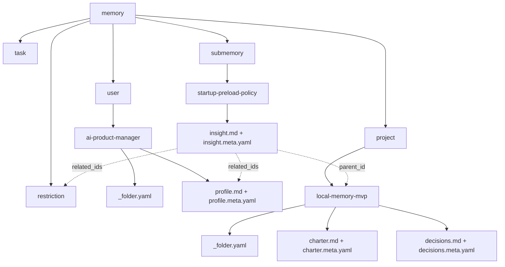
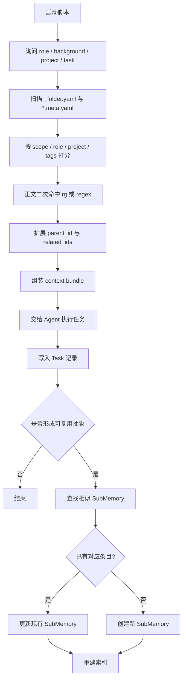

# Local Memory Skills 本地记忆Skills

##  本地 Agent 记忆系统 0→1 MVP 设计报告

---
## 执行摘要

这套 MVP 的正确方向，不是先追求“像人一样会联想的记忆”，而是先做成一个**可解释、可审计、可 diff、可本地运行**的记忆路由层。对 0→1 阶段来说，最稳的选择是：**Markdown 负责正文，YAML 负责结构化元数据，Git 负责版本与协作**。Markdown 本身就是面向结构化文档的纯文本格式；而 YAML front matter 虽然常见，但它要求元数据必须放在文件最顶部。基于这一点，MVP 更适合采用 **`*.md + *.meta.yaml` sidecar** 的双文件方式，而父节点目录再配一个 **`_folder.yaml`**。这样正文保持纯 Markdown，元数据可以独立校验、独立 merge、独立检索。

在元数据设计上，我建议你把“稳定身份”和“可变内容”分开：每个记忆对象都有稳定 `id`，用 `parent_id` 建树，用 `tags / roles / project_refs / scope` 做筛选，用 `created_at / updated_at / reviewed_at / rev` 管生命周期。时间字段统一写成**带引号的 RFC 3339 字符串**，布尔值统一写成小写 `true/false`。这是因为 YAML 1.2 的推荐默认是 core schema，`true/false` 才是布尔值的标准写法，而且 YAML 1.2 已移除 `!!timestamp` 这类类型；RFC 3339 则明确给出互联网时间戳的统一格式和时区表达方式。

检索层不做向量 RAG，也不需要外部服务。MVP 只做两步：**先扫文件名与 YAML 元数据，再做内容二次命中**。文件系统扫描可以直接用 Python 的 `os.walk(..., followlinks=False)`，默认不追符号链接；内容二次命中优先用 `ripgrep`，因为它天然做递归搜索，并默认尊重 `.gitignore`、跳过隐藏文件和二进制文件。对本地私有仓来说，这已经足够支撑一个 deterministic 的 Agent 启动预加载流程。

Git-ready 的关键，不是“能提交”，而是“能稳定提交”：把 hooks 放进版本库并通过 `core.hooksPath` 启用；用 `yamllint` 做 YAML 语法与重复键/缩进检查；需要更强结构校验时，再在本地用 `yaml.safe_load` + `jsonschema` 做 schema 校验；再配上 `.gitattributes` 把 Markdown/YAML 的行尾固定为 LF，减少跨平台无效 diff。要注意，`pre-commit` 可以被 `--no-verify` 绕过，所以它是 guardrail，不是治理的最终边界。

| 维度   | MVP 推荐结论                                                     |
| ---- | ------------------------------------------------------------ |
| 存储   | `Markdown + sidecar YAML + _folder.yaml`                     |
| 检索   | `metadata scan -> lexical rank -> rg second pass -> preload` |
| 写回   | `Task` 记录全程、`SubMemory` 孵化复用结论                               |
| Git  | `.githooks + core.hooksPath + yamllint + validate_memory.py` |
| 冲突处理 | 标量谨慎、列表合并、正文按 section merge、追加日志可选 `merge=union`             |
| 安全   | 本地-only、scope 过滤、路径归一化、不要把 secrets 当 memory                  |

## 设计原则与关键取舍

你现在最容易踩的坑，不是“没有 memory folder”，而是把三类东西混在一起：**主干记忆**、**任务过程**、**新发现但尚未稳定的抽象**。所以我建议一开始就分三层：  
**主干层**放 `user / project / restriction`，它们是稳定、长期复用的上下文；  
**执行层**放 `task`，它记录每次任务到底读了什么、做了什么、产出了什么；  
**孵化层**放 `submemory`，它承接“这次任务里新冒出来、但还不该直接污染主干”的抽象。这个分层，比单纯堆目录更重要，因为它直接决定你的 Agent 写回策略是否会越写越脏。这个判断是产品设计取舍：先保证记忆结构的可维护性，再谈自动化。 

从文件组织方式看，front matter 并不是不能用，而是不适合做你的第一版主方案。CommonMark 让 Markdown 成为稳定的纯文本正文格式；Jekyll 和 Hugo 这类常见工具都把 front matter 视为“位于文件最前面的 metadata 区块”。这意味着只要正文编辑习惯稍乱、或者未来让不同脚本同时改正文和元数据，冲突面就会很大。用 sidecar YAML 的本质收益，不是“更优雅”，而是**更好验证、更好 diff、更好拆责**。

| 元数据布局方案 | 优点 | 缺点 | MVP 建议 |
| --- | --- | --- | --- |
| Markdown front matter | 单文件、阅读聚合 | metadata 必须在文件顶部；正文和元数据更容易冲突 | 不作为主方案 |
| `doc.md + doc.meta.yaml` | 正文与结构解耦；最容易做 lint / schema 校验 | 一份内容变成两文件 | **文档主方案** |
| `目录 + _folder.yaml` | 父节点天然有元数据；方便建树和预加载 | 目录节点通常还要搭配一份 summary 文档 | **父节点主方案** |

命名规范上，我建议你全仓采用**路径小写 kebab-case、对象 ID 小写 dot-path**。路径是给文件系统和 Git 用的，ID 是给 Agent 和索引用的。路径可以改名，ID 尽量不改。这样你以后就能同时获得“人类可读导航”和“程序稳定引用”。同时，把显示名称放到 `title`，不要让自然语言标题承担唯一标识责任。时间写 RFC 3339，布尔值写 `true/false`，不要把 `yes/on` 这种 YAML 1.1 时代的写法带进来。

| 对象 | 路径规则 | ID 规则 | 示例 |
| --- | --- | --- | --- |
| 根目录 | `memory/` | 无 | `memory/` |
| 类别目录 | 全小写 | `root.<kind>` | `memory/user/` → `root.user` |
| 具体父目录 | kebab-case | `kind.<slug>` | `memory/project/local-memory-mvp/` → `project.local-memory-mvp` |
| 文档正文 | `noun-purpose.md` | `kind.<slug>.<doc>` | `charter.md` → `project.local-memory-mvp.charter` |
| 文档元数据 | 同名 `.meta.yaml` | 与正文一一对应 | `charter.meta.yaml` |
| 文件夹元数据 | `_folder.yaml` | 该目录节点 ID | `memory/project/local-memory-mvp/_folder.yaml` |

## 信息架构与 YAML 设计

我建议第一版最小目录树长这样。重点不是“目录多”，而是**每一类目录的职责单一**：`user` 记录人和角色，`project` 记录业务上下文，`restriction` 记录硬边界，`task` 记录每次执行，`submemory` 记录尚未晋升为主干的抽象。  

```text
agent-memory/
  README.md
  memory/
    user/
      _folder.yaml
      ai-product-manager/
        _folder.yaml
        profile.md
        profile.meta.yaml
    project/
      _folder.yaml
      local-memory-mvp/
        _folder.yaml
        charter.md
        charter.meta.yaml
        decisions.md
        decisions.meta.yaml
    restriction/
      _folder.yaml
      company-internal.md
      company-internal.meta.yaml
    task/
      _folder.yaml
    submemory/
      _folder.yaml
    _index/
      memory_index.json
      lookup.tsv
  templates/
    user.md
    project.md
    restriction.md
    task.md
    submemory.md
  schemas/
    folder.schema.json
    doc.schema.json
  scripts/
    startup_memory.py
    reindex.py
    validate_memory.py
    bootstrap.sh
  .githooks/
    pre-commit
  .gitignore
  .gitattributes
  Makefile
```



YAML 字段设计上，我建议你让**写入最频繁的字段足够少**，否则以后 merge 会很痛。尤其是父子关系，MVP 阶段最好采用“**文档必填 `parent_id`，`child_ids` 由重建索引自动生成**”的策略，而不是两边都手动维护。YAML 规范要求 mapping key 唯一，重复键会造成歧义；这也是为什么 sidecar YAML 更适合被 lint 和 schema 校验，而不是把一堆可变 metadata 混进正文。

| 设计点 | 方案 A | 方案 B | 取舍建议 |
| --- | --- | --- | --- |
| 父链接 | `parent_id` | `parent_path` | **选 `parent_id`**；重命名目录不破引用 |
| 子链接 | 手写 `child_ids` | 重建索引自动生成 | **MVP 选自动生成**；少维护、少冲突 |
| 角色 | `role: string` | `roles: [..]` | **选列表**；一个记忆可能服务多个角色 |
| 标签 | 自由文本字符串 | `tags: [kebab-case]` | **选列表**；便于精确匹配和 union merge |
| 版本 | `doc_version: semver` | `rev: integer` | **MVP 强制 `rev`，可选 semver**；机器更好处理 |
| 访问控制 | `access enum` | `allowed_roles` list | **两个都要**；前者快筛，后者细控 |
| 相关关系 | `related_ids` | 无 | **保留**；支持横向扩展和二跳加载 |

下面给你一组**可直接落地**的 YAML 示例。这里我有意把时间戳写成带引号的 RFC 3339 字符串，把布尔值写成标准小写布尔值。

```yaml
# memory/project/local-memory-mvp/_folder.yaml
schema_version: "1.0"
id: "project.local-memory-mvp"
kind: "folder"
title: "Local Memory MVP"
slug: "local-memory-mvp"
summary: "本地 Agent 记忆系统 MVP 的项目父节点"
links:
  parent_id: "root.project"
  child_ids:
    - "project.local-memory-mvp.charter"
    - "project.local-memory-mvp.decisions"
taxonomy:
  tags: ["agent-memory", "mvp", "local-only"]
  roles: ["product-manager", "engineer"]
scope:
  access: "team"
  allowed_roles: ["product-manager", "engineer"]
lifecycle:
  status: "active"
  created_at: "2026-05-28T10:15:00-07:00"
  updated_at: "2026-05-28T10:15:00-07:00"
  reviewed_at: "2026-05-28T10:15:00-07:00"
version:
  rev: 1
  doc_version: "0.1.0"
preload:
  always: false
  when_project: ["local-memory-mvp"]
  when_role_any: ["product-manager"]
```

```yaml
# memory/project/local-memory-mvp/charter.meta.yaml
schema_version: "1.0"
id: "project.local-memory-mvp.charter"
kind: "project"
title: "项目章程"
slug: "charter"
links:
  parent_id: "project.local-memory-mvp"
  related_ids:
    - "restriction.company-internal"
    - "user.ai-product-manager.profile"
taxonomy:
  tags: ["charter", "scope", "goal"]
  roles: ["product-manager"]
  project_refs: ["local-memory-mvp"]
scope:
  access: "team"
  allowed_roles: ["product-manager", "engineer"]
lifecycle:
  status: "active"
  created_at: "2026-05-28T10:16:00-07:00"
  updated_at: "2026-05-28T10:16:00-07:00"
  reviewed_at: "2026-05-28T10:16:00-07:00"
version:
  rev: 1
  doc_version: "0.1.0"
ownership:
  owner: "@si6moonlxy"
load_hints:
  preload_rank: 90
  always: false
  on_task_keywords: ["mvp", "architecture", "memory", "agent"]
merge_policy:
  strategy: "manual"
  append_only: false
```

```yaml
# memory/submemory/startup-preload-policy/insight.meta.yaml
schema_version: "1.0"
id: "submemory.startup-preload-policy.insight"
kind: "submemory"
title: "启动预加载策略"
slug: "insight"
links:
  parent_id: "root.submemory"
  derived_from_task_ids:
    - "task.2026-05-28.agent-memory-mvp"
  related_ids:
    - "project.local-memory-mvp.charter"
taxonomy:
  tags: ["preload", "startup", "retrieval-policy"]
  roles: ["product-manager", "engineer"]
scope:
  access: "team"
  allowed_roles: ["product-manager", "engineer"]
lifecycle:
  status: "draft"
  created_at: "2026-05-28T11:20:00-07:00"
  updated_at: "2026-05-28T11:20:00-07:00"
  reviewed_at: "2026-05-28T11:20:00-07:00"
version:
  rev: 1
promotion:
  promote_to_parent_kind: "project"
  promote_when_reuse_count_gte: 2
merge_policy:
  strategy: "manual"
  append_only: false
```

Markdown 模板我建议做成**短骨架**，不要一上来就设计成百科全书。模板过厚会导致你和 Agent 都不愿意维护。

```md
<!-- templates/user.md -->
# 用户画像
## 背景
## 工作方式
## 偏好
## 反偏好
## 常见决策模式
## 与项目相关的角色边界
## 最近更新

<!-- templates/project.md -->
# 项目总览
## 目标
## 范围
## 非目标
## 关键里程碑
## 当前状态
## 关键决策
## 风险与假设
## 最近更新

<!-- templates/restriction.md -->
# 约束说明
## 来源
## 必须遵守
## 禁止事项
## 资源与时间边界
## 合规与隐私边界
## 例外条件
## 最近更新

<!-- templates/task.md -->
# 任务记录
## 输入
## 启动时加载的记忆
## 任务过程摘要
## 输出
## 新增或更新的记忆候选
## 复盘
## 最近更新

<!-- templates/submemory.md -->
# 子记忆
## 触发场景
## 可复用结论
## 适用边界
## 升级条件
## 父记忆与关联记忆
## 最近更新
```

## 启动脚本与本地检索流程

这部分你可以把它理解成一个**本地 memory router**。它不是做语义召回，而是在任务开始前，先用确定性规则把“最该读的文档”送进上下文。实现上，脚本先用 `os.walk(..., followlinks=False)` 扫描 `*.meta.yaml` 和 `_folder.yaml`，再用 `yaml.safe_load` 解析成 Python 对象；如果需要做正文二次命中，就调用 `ripgrep`，因为它天生适合递归文本搜索，并且默认尊重 `.gitignore`。同时，脚本不应该允许用户直接传任意文件路径作为读取目标，而应该只接收 role / background / project / task 这类**选择器**，再由程序自己把路径限制在仓内。citeturn9view1turn9view2turn15view1turn17view0turn17view1turn18view0turn18view2

| 检索层 | 输入 | 方法 | 输出 | 成本 |
| --- | --- | --- | --- | --- |
| 元数据粗筛 | 文件名、title、tags、roles、project_refs、scope | YAML 扫描 + 打分 | 候选文档列表 | 很低 |
| 正文二筛 | task 描述、关键词 | `rg` 或 Python regex | 命中文档与段落 | 低 |
| 关系扩展 | parent_id / related_ids | 读取索引图 | 父节点与关联节点 | 很低 |
| 预加载组装 | Top-K 候选 | 固定顺序拼接 | 最终 context bundle | 低 |

预加载顺序我建议固定为：**Restriction -> User -> Project -> SubMemory -> 最近 Task**。这比纯相关性排序更稳，因为 restriction 是硬边界，user 是行为偏好，project 是业务上下文，submemory 是近期抽象，task 才是短期轨迹。产品上，这叫**上下文优先级分层**，比“谁分高先读谁”更符合真实工作流。



下面这段伪代码就是你要的**轻量启动流**。它做四件事：询问输入、加载命中文档、执行任务、提交写回建议。

```python
def startup():
    role = ask("你的当前角色")
    background = ask("背景补充")
    project = ask("当前项目")
    task = ask("本次任务目标")

    index = load_cache_if_fresh() or reindex("memory/")
    candidates = []

    for entry in index:
        if not scope_allows(entry, role):
            continue

        score = 0
        score += 40 if project in entry.get("project_refs", []) else 0
        score += 30 if role in entry.get("roles", []) else 0
        score += 15 if overlap(task.keywords, entry.get("tags", [])) else 0
        score += entry.get("preload_rank", 0)
        score += recency_bonus(entry.get("updated_at"))

        if score > 0:
            candidates.append((score, entry))

    top_entries = top_k(candidates, k=12)
    top_entries = second_pass_content_match(top_entries, task)
    bundle = expand_parents_related(top_entries, index)
    loaded_docs = load_markdown_files(bundle)

    result = run_agent(task=task, context=loaded_docs, background=background)

    task_log = write_task_memory(
        role=role,
        background=background,
        project=project,
        task=task,
        loaded_ids=[e["id"] for e in bundle],
        result=result,
    )

    proposal = propose_new_memory(result, task_log)

    if proposal.reusable:
        similar = find_similar_submemory(index, proposal)
        choice = ask_choice(["update", "create", "ignore"], default="update" if similar else "create")
        if choice == "update":
            update_submemory(similar, proposal)
        elif choice == "create":
            create_submemory(proposal, parent_id=proposal.parent_id)

    reindex("memory/")
```

`SubMemory` 的创建条件要写死，不要让 Agent 想建就建。我的建议是只有三种情况才写入：**形成稳定偏好**、**形成稳定约束**、**形成重复可复用的决策规则**。如果只是一次性中间过程，就只写到 `task/`，不要污染主干和 submemory。

```bash
# scripts/bootstrap.sh
#!/usr/bin/env bash
set -euo pipefail
git config core.hooksPath .githooks
chmod +x .githooks/pre-commit
git config rerere.enabled true
python3 scripts/reindex.py
echo "bootstrap done"
```

```bash
# 机器上有 rg 就用 rg，没有就退回 Python regex
rg -n --glob '*.md' 'memory|agent|restriction|preload' memory/
```

## Git 集成、校验与冲突处理

Git-ready 的第一原则是：**把可共享的东西放在 working tree，把 Git 自己的内部目录留给 Git**。Git 官方文档明确把 `.git` 视为仓库内部目录；hooks 默认也在 `$GIT_DIR/hooks`，但可以通过 `core.hooksPath` 改到你自己版本化的目录。因此，模板、脚本、schemas、`.githooks/` 都应该放在仓库工作区内，由 bootstrap 脚本一次性配置好。这样 repo clone 下来就是可用的，不需要每个人手工 copy hooks。

```text
agent-memory/
  memory/
  templates/
  schemas/
  scripts/
  .githooks/
  .gitignore
  .gitattributes
  README.md
```

`.gitignore`、`.git/info/exclude`、`core.excludesFile` 的职责一定要分清。Git 文档写得很清楚：**需要随仓库共享的忽略规则放 `.gitignore`；只对当前仓库当前用户有意义的忽略规则放 `.git/info/exclude`；跨所有仓库的个人忽略规则放 `core.excludesFile`**。这对公司内场景很关键，因为你可以把每个人机器上的私有 scratch 文件挡在版本库外，而不污染团队共享的 `.gitignore`。

```gitignore
# generated
memory/_index/
runtime/
tmp/
logs/

# python
__pycache__/
*.pyc
.venv/

# local config / secrets
.env
.env.*
*.local.yaml
config.local.yaml
```

`pre-commit` 很适合做本地守门：Git 会在 commit 前调用它，脚本返回非零状态就会中止提交；但它也可以被 `--no-verify` 绕过。所以我的建议是：**把它定位为“防粗心”机制，而不是“强合规”机制**。另外，hooks 文件如果没有执行位，会被 Git 忽略，所以 bootstrap 里一定要 `chmod +x`。

```bash
# .githooks/pre-commit
#!/usr/bin/env bash
set -euo pipefail

python3 scripts/validate_memory.py

if command -v yamllint >/dev/null 2>&1; then
  yamllint memory schemas
fi
```

YAML 校验建议分两层：第一层用 `yamllint` 抓语法、重复键、缩进、尾空格这类低级错误；第二层在 Python 里用 `yaml.safe_load` 把 YAML 读成普通对象，再做 ID 唯一性、父节点存在性、时间格式、scope 枚举值这类业务规则校验。`yaml.safe_load` 的意义在于，它只识别标准 YAML 标签，不会像不安全的 `yaml.load` 一样构造任意 Python 对象。若你希望把结构约束也声明化，再加 `jsonschema` 即可。

```python
# scripts/validate_memory.py
import os, sys, yaml
from pathlib import Path
from datetime import datetime

ROOT = Path(__file__).resolve().parents[1]
MEM = ROOT / "memory"
ALLOWED_ACCESS = {"private", "team", "org", "public-redacted"}

def load_yaml(path):
    with open(path, "r", encoding="utf-8") as f:
        return yaml.safe_load(f) or {}

def valid_dt(s):
    try:
        datetime.fromisoformat(s.replace("Z", "+00:00"))
        return True
    except Exception:
        return False

ids, errors = {}, []

for root, dirs, files in os.walk(MEM, followlinks=False):
    for name in files:
        if name.endswith(".meta.yaml") or name == "_folder.yaml":
            p = Path(root) / name
            data = load_yaml(p)
            obj_id = data.get("id")
            if not obj_id:
                errors.append(f"{p}: missing id")
                continue
            if obj_id in ids:
                errors.append(f"{p}: duplicate id {obj_id}")
            ids[obj_id] = p

            scope = (data.get("scope") or {}).get("access")
            if scope and scope not in ALLOWED_ACCESS:
                errors.append(f"{p}: bad access {scope}")

            for fkey in ("created_at", "updated_at", "reviewed_at"):
                v = (data.get("lifecycle") or {}).get(fkey)
                if v and not valid_dt(v):
                    errors.append(f"{p}: bad datetime {fkey}={v}")

if errors:
    print("\n".join(errors))
    sys.exit(1)
```

行尾和 merge 行为要在第一天就定好，不然后面会付出双倍成本。Git 的 `text` / `eol` 属性可以把仓库中的文本标准化为 LF，并在工作区控制行尾样式；如果 `eol` 不显式指定，默认行为会受平台和 Git 配置影响。对 Markdown 和 YAML 来说，最干净的做法就是直接固定为 LF。

```gitattributes
* text=auto
*.md   text eol=lf
*.yaml text eol=lf
*.yml  text eol=lf

# 只给“追加型日志”用，核心记忆文档不要轻易用
task/**/*.md merge=union
```

冲突处理要追求**简单且一致**。Git 的内建 `union` merge driver 会把双方新增行都保留下来，但官方文档明确提醒：新增行顺序可能是随机的，结果必须人工检查；自定义 merge driver 的定义又是在 `.git/config` 里，不在 `.gitattributes` 里。对 MVP 来说，最好的策略不是上来就发明复杂 merge driver，而是先把字段分型，然后套很朴素的规则；必要时开启 `rerere`，让 Git 记录和复用你之前的手工冲突解法。

| 冲突对象 | 建议规则 |
| --- | --- |
| `id / kind / parent_id` | 任何冲突都手工处理，不自动 merge |
| `title / summary / status / access` | 若仅一侧改动则直接取改动；双方都改且不同则手工处理 |
| `tags / roles / related_ids` | 集合并集，去重后保序 |
| `created_at` | 取更早值 |
| `updated_at / reviewed_at` | 取更晚值 |
| `version.rev` | merge 后手动 `+1`，不要自动猜 |
| 正文 Markdown | 按 section 解决；标题级别固定，减少同段冲突 |
| 追加型 Task 日志 | 可选 `merge=union`，但必须人工复核顺序 |

## 安全、测试与最小演示

如果这个系统用于公司内部，我强烈建议你把 `scope.access` 设计为一等公民，而不是备注字段。NIST 对 least privilege 的定义很直接：只给完成任务所必需的授权访问。映射到你的场景，就是**启动脚本只能加载当前 role + 当前 project + 当前 access scope 允许的记忆**，不要让 Agent “顺手”把整个仓库都读了。隐私治理层面，NIST Privacy Framework 也强调组织要识别和管理 privacy risk，而不是把“本地就安全”当成天然免责。

路径安全同样不能偷懒。OWASP 明确指出，不应把不可信的文件输入直接交给文件 I/O；同时也建议用已知安全的索引/受控路径，而不是让用户自由拼接路径。配合 Python `os.walk(..., followlinks=False)` 的默认行为，你的脚本最好只接受 selector，不接受裸路径；若未来一定要接受路径，也必须做 `resolve()`、校验仓根前缀、拒绝越界和符号链接绕行。

测试、训练、演示数据不要直接用真实敏感数据。NIST 在 PM-25 里明确指出，PII 用于测试、训练和研究会增加未授权披露或误用风险，并建议在可能时使用 placeholder data。对你的 Agent memory repo 来说，这意味着：**演示模板、样例项目、测试任务全部用脱敏或占位数据；真正敏感的公司细节要么不进仓，要么放在本地受控区域且不纳入普通检索范围**。如果你担心开发者误提交 secrets，可以在本地加一层 `git-secrets`，它会扫描 commit、commit message 以及非快进合并历史，并在命中禁用模式时拒绝提交。

下面这个 checklist，建议你在 MVP 验收时逐项过一遍。

| 测试项 | 通过标准 |
| --- | --- |
| 目录完整性 | 每个 `*.md` 都有对应 `*.meta.yaml`；每个目录节点都有 `_folder.yaml` |
| ID 唯一性 | 全仓无重复 `id` |
| 父子关系 | 所有 `parent_id` 都能在索引中找到 |
| 时间格式 | 所有时间字段都能解析为 RFC 3339 |
| 作用域过滤 | 非授权 role 不能加载不该读的文档 |
| 检索效果 | 输入 role/project/task 后，Top-K 命中顺序符合预期 |
| 写回规则 | 任务结束后，能正确区分 `task` 记录与 `submemory` 沉淀 |
| Git 体验 | clone 后运行一次 bootstrap 即可提交；invalid YAML 会被 hook 拦下 |
| 冲突处理 | 双人并发修改 tags / roles / body 时，merge 结果符合规则 |
| 安全性 | 任意路径输入无法越出仓根；示例数据不含真实 secrets/PII |

最后给你一个最小 demo walkthrough。这个 Demo 不追求花哨，只验证闭环。

1. 初始化仓库，放三份种子记忆：  
   `memory/user/ai-product-manager/profile.md`  
   `memory/project/local-memory-mvp/charter.md`  
   `memory/restriction/company-internal.md`

2. 运行：
   ```bash
   bash scripts/bootstrap.sh
   python3 scripts/startup_memory.py
   ```

3. 启动脚本提问：  
   `role = product-manager`  
   `background = AI 产品经理，重度使用 Agent`  
   `project = local-memory-mvp`  
   `task = 设计本地 Agent memory MVP`

4. 脚本先扫描 YAML，筛出 `restriction/company-internal`、`user/ai-product-manager/profile`、`project/local-memory-mvp/charter`，再对 Markdown 做一次关键词二筛，最后生成一个 `context bundle`。

5. Agent 完成任务后，脚本把本次执行落到 `task/<date>-<slug>.md`，并弹出选择：  
   `检测到可复用抽象：启动预加载策略`  
   `[1] 更新已有 SubMemory  [2] 创建新 SubMemory  [3] 忽略`

6. 你选择创建后，系统生成：  
   `memory/submemory/startup-preload-policy/insight.md`  
   `memory/submemory/startup-preload-policy/insight.meta.yaml`  
   然后重建 `_index/`，最后再 `git add . && git commit`。

如果你把这套第一版做出来，它会非常“朴素”，但这是对的。因为对公司内 Agent memory 来说，第一阶段真正值钱的，不是召回 fancy，而是**结构稳定、检索可解释、写回不污染、Git 协作不痛苦**。等这四件事跑顺了，你再考虑 embedding、重排序、局部摘要缓存，才是合理的升级路径。

---
***Written By Six_moon***